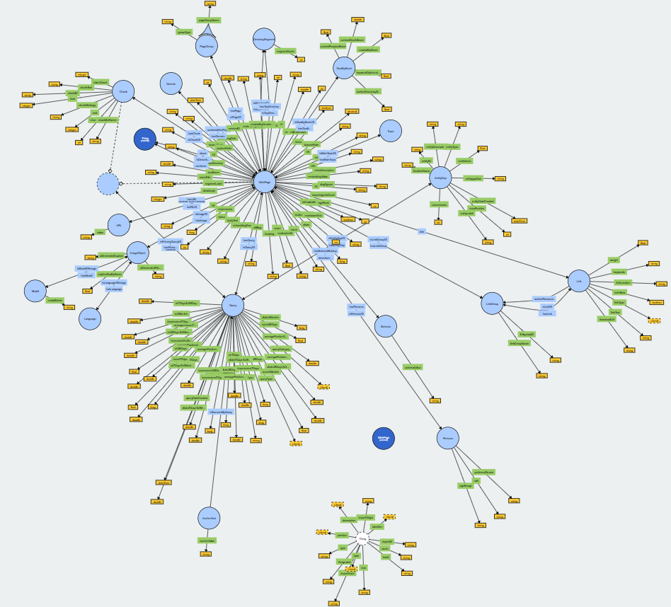

# SEOntology

## Description

The **SEOntology** is the open-source semantic framework, initially developed by WordLift and then enriched with contributions from SEO experts, knowledge engineers, and developers. It serves as a semantic operating system for modern SEO, enabling agents, apps, and researchers to reason about, audit, and optimize web content through a shared vocabulary. To simplify, think of it as an operating system for your content strategy. This ontology bridges SEO practice with linked data standards, powering automation, structured reasoning, and explainable AI across the entire content lifecycle. This is an early draft.

## Use Cases Covered

- **AI-Powered Content Summarization and Metadata Generation**
- **Semantic Internal Linking via Chunk and Query Similarity**
- **Entity Linking and Disambiguation in Web Content**
- **Graph-Based Internal Linking Optimization**
- **Query Clustering and Intent Modeling for Content Strategy**
- **Training Goal-Relevant Reasoning Models Using SEOntology and GRPO**
- **Provenance Tracking for SEO Actions and Content Evolution**
- **Multilingual SEO Alignment and Semantic Consistency**
- **SERP Feature Optimization for Enhanced Search Visibility**
- **Automated Image Captioning and SEO Optimization**

## Features

- **Main Classes**: Our ontology provides a comprehensive coverage of various SEO elements, such as:
  - `WebPage`: The primary entity representing a specific webpage, extended from Schema.org.
  - `Query`: The query for which the webpage ranks in SERPs, usually obtained through Google Search Console.
  - `URL`: The unique identifier for the webpage.
  - `AnchorText`: The anchor text which is influenced by the Query that the WebPage ranks for.
  - `Link`: Representing an internal or external link found on the webpage through crawling.
  - `LinkGroup`: A collection of links that are logically grouped, such as menus or footers.
  - `Chunk`: A semantically meaningful text segment or section within a webpage.
  - `EntityGap`: A placeholder for missing or unlinked entities relevant to the content.
  - `ImageObject`: A representation of an image and its associated SEO metadata.
  - `Language`: The language associated with content, useful for multilingual SEO.
  - `Topic`: The central concept or subject a WebPage is about.
  - `Schema`: All schema markup elements found on the webpage, in JSON-LD or other formats.
  - `Model`: AI or ML models used for tasks such as summarization, classification, or scoring.
  - `QualityScore`: A scoring container that aggregates content and SEO quality dimensions.
  - `Persona`: The modeled archetype of a target user or audience segment.
  - `DirectorySegment`: A logical segment in the site structure, derived from URL paths.
  - `Domain`: A high-level grouping of pages based on domain or subdomain.
  - `PageGroup`: A category or cluster of pages grouped by semantic or structural similarity.
  - `Thing`: The most generic type of item, expressed as an extension of the Thing class in Schema.org.

- **Selected Object Properties**: These define relationships between core SEO entities:
  - `hasQuery` / `isQueryOf`: Links a WebPage to one or more Queries it ranks for.
  - `hasPrimaryQuery` / `isPrimaryQueryOf`: Connects a WebPage or Chunk to its primary target Query.
  - `hasChunk` / `isChunkOf`: Links a WebPage to its content segments (Chunks).
  - `hasImage` / `isImageOf`: Connects a WebPage with embedded ImageObjects.
  - `hasLinkGroup` / `isLinkGroupOf`: Associates a WebPage with its LinkGroups.
  - `hasLink` / `isLinkOf`: Connects a LinkGroup to individual Links.
  - `hasPersona` / `isPersonaOf`: Maps a WebPage to its targeted Persona.
  - `hasURL` / `isURLOf`: Binds a WebPage to its canonical URL.
  - `about` / `isDescribedBy`: Relates a WebPage to the main entity (Thing) it discusses.
  - `mentions`: Identifies entities (Thing) mentioned within the content.
  - `hasEntityGap` / `isEntityGapOf`: Captures missing or unlinked entities for a Query.
  - `hasQualityScore` / `isQualityScoreOf`: Relates a WebPage to a container of quality metrics.
  - `hasSchemaMarkup` / `describesPage`: Links a WebPage with its structured schema markup.
  - `hasModel` / `isModelOfImage`: Associates an AI model with an image used or generated.
  - `hasLanguage` / `isLanguageOfImage`: Defines the language of an image or associated text content.
  - `hasTopic` / `isMainTopicOf`: Captures the core Topic of a WebPage.

- **Selected Data Properties**: These attributes capture literal values and numerical metrics:
  - `title`: The HTML or SERP title of the WebPage.
  - `metaDescription`: The SEO meta description used for snippet generation.
  - `bodyText`: The full textual content extracted from a WebPage.
  - `chunkText`, `chunkPosition`: The text and order of appearance of a Chunk within a WebPage.
  - `anchorValue`: The literal string value of an AnchorText.
  - `aiGeneratedCaption`, `captionQualityScore`: AI-generated image metadata and quality assessment.
  - `embeddingText`, `embeddingValue`: Textual input and vector output for AI embedding models.
  - `contentAccuracyScore`, `contentDepthScore`, `seoScore`, `readabilityScore`: Quality dimensions that help assess and optimize content.
  - `clicks`, `ctr`, `impressions`: Performance metrics retrieved from tools like Google Search Console.
  - `forecastedTraffic`: Predicted traffic volume based on a model.
  - `queryType`, `keywordType`, `queryCategory`: Classification of a query by intent or semantics.
  - `slugNgram`, `urlSlug`: Linguistic and structural attributes derived from the URL.
  - `intent`: The inferred or labeled intent behind a search Query or WebPage target.
  - `evaluationID`: An identifier used for tracking scoring or benchmarking results.
  - and more!
 
## SEOntology Visualized


## Getting Started

### Prerequisites

- [Protege](https://protege.stanford.edu/) or any other ontology editing tool
- Basic knowledge of [OWL/RDF/SPARQL/any other relevant technology]
- [TIB EU visualisation software](https://service.tib.eu/webvowl/) to analyze the ontology (Select 'ontology' from the bottom menu -> click 'Select ontology file')
  
### Installation & Setup

1. Clone this repository:
   ```bash
   git clone [URL to your repo]
   ```
2. Open the ontology file in Protege or your preferred ontology editor.

## How to Contribute

1. Fork this repository.
2. Create a new branch for your changes.
3. Make and commit your changes.
4. Push your branch to your fork.
5. Open a pull request from your fork to this repository.
6. After review and discussion, if your changes are approved, they will be merged.

## Versioning

We use [Semantic Versioning](http://semver.org/) for this project.

## Communication & Discussion

- [Thread on X](https://x.com/cyberandy/status/1715853285838430358?s=20)
- For issues, use the GitHub [issues](link_to_issues_page) page.

## Publications

* Andrea Volpini. "[Introducing SEOntology: The Future Of SEO In The Age Of AI](https://www.searchenginejournal.com/introducing-seontology-the-future-of-seo-in-the-age-of-ai/524773/)". Search Engine Journal, August 2024.
* Emilija Gjorgjevska. "[SEOntology: The Basis for Next-Gen SEO](https://www.youtube.com/watch?v=gM6egAImB1o)". Zagreb SEO Summit, June 2024.

## Sponsor

This project is sponsored by [WordLift](https://www.wordlift.io/), a leading provider of AI-powered solutions for content optimization and knowledge graph creation. Their support enables us to continue developing and maintaining this open-source project, empowering our community with valuable tools and resources.

## Documentation

Detailed documentation will be soon available.

## License
This project is licensed under the MIT [LICENSE](LICENSE.md) - see the LICENSE.md file for details.
